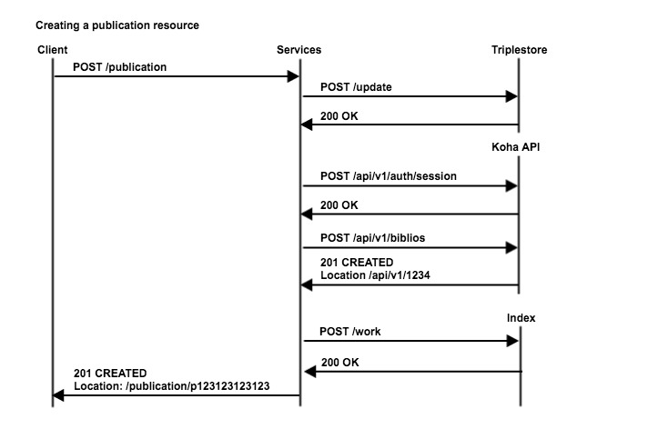

#Flow in HTTP interfaces in LS.ext

Greenall, Rurik Thomas

Computas AS

2017-02-09

##Overview

This document describes the various ways in which APIs are queried, their responses and how these are called in flows when requesting, creating, updating and deleting resources.

##Creating resources
###Creating non-publication resources

###Creating publication resources

Note that the _work_ index is updated.
