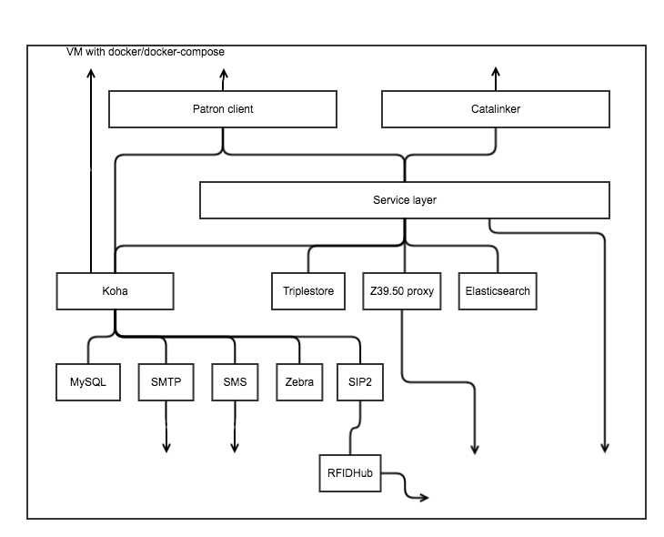

#Oslo Public Library — Application project

2016-12-07

##Who

###Arve Søreide

Project manager

###Asgeir Rekkavik

Ontology development

###Benjamin Rokseth

Engineer

###Bjørn-Erik Bjorgan

UX-designer

###Kristoffer Moe

Consultant

###Nicho Paulik

Consultant

###Petter Goksøyr Åsen

Engineer

###Ru Greenall

Consultant

##What we have done

Project to build the new library system for Oslo public library based on open-source and linked data. 

The project is very much focussed on getting Oslo public library's new library system up-and-running, and not at all on creating open-source tools for libraries.

##Where we are

Live since mid-October, final hand-over in February. At the end of February, the project officially ends and the continuation of the development will be continued in-house. The phase two project focusses on other areas of library services (room booking, displays, media production and so on).

##How we did it
Iterative, feature-driven development. Lots of tests, lots of modular, microservice architecture. And Koha.

###System architecture

The general architecture is microservice-oriented and container-based. We containerize our services with Docker and use Docker-compose for orchestration.

This is a very simple set-up that works well enough for production, testing and development. In development and testing we use slightly different set-ups and a number of tools that are not used in production.

####Service layer

We have something resembling an enterprise service bus, a but this is not quite the case as the service layer is distributed between containers, however, the service is master for metadata, the search index and co-ordinates metadata with Koha. Data is stored as linked data.

The service layer is a Java 8 web application run in Jetty; interaction with the service layer is via REST and it is this layer that dictates what our linked data is. We use Jersey as our REST API and Apache Jena as our RDF API; the platform also understands MARC in various ways, being able to parse MARC to an RDF format that is used by the Catalinker module and produces the MARC21 that is used by the Koha module.

####Koha

Koha is master for holdings, patrons and circulation. 

The bibliographic metadata in Koha is a minimal representation of MARC21 + RDA (33X fields for representing media and formats that were expressed in NORMARC) and is generated from and synchronized with linked data, and is used for:

- convenience for librarians when performing holdings-related tasks
- generating the national-library mandated statistics that are based on NORMARC facets
- Inter-library loan
- Providing MARC data to those that want it

Koha interfaces with circulation workflows via APIs and *is never* seen by patrons; the Koha interface *is* used as the back-office interface.

We have extended Koha in numerous ways in collaboration with the Koha community and several provide bug fixes for each release as we are early adopters (currently 16.11). We have some patches (currently 31) that support local needs related to how we use Koha in our installation — which is very far from most installations.

The APIs added to Koha provide access to circulation and patron data for use in the patron client module; other APIs have been added to replace Koha's aging SVC interface so we can read/write data from the service layer.

####Patron client

The patron client is a React/Redux node application that is used to provide user interfaces for end-user tasks like:

- searching the catalogue 
- self-registration
- keeping user information up-to-date
- managing lends

The search interface is also used by staff and has advance search syntax hidden under-the-hood.

This module is internally very modularized and a lot of time has been spent making it easy to develop in a pattern that most developers will understand.

Due to the fact that the patron client is the Javascript application that we developed last, we have been able to use the JSON-LD framing algorithm extensively. This means that the JSON used in the application, while actually JSON-LD, actually looks and feels like working with bog-standard JSON.

This module interacts extensively with the services layer and the Koha APIs; the former providing search and data and the latter providing circulation, patron and holdings data.

####Catalinker

Catalinker is a complex configuration-driven, Ractive/node application that reads and writes data to the services layer. 

The application reads linked data as JSON-LD and writes RDF patches back to the service layer. This workflow means that we did not have to create another application that "understands" RDF in any sense, just one that can read and transform it.

The application also interacts with indexes, which provide access to the many resources that are used in cataloguing (authorities, or linked data, if you will).

There are several workflows in the application that are used for different media.  The core ontology is used to define the catalinker application and it is from this that the configurations for the elements in the workflows are derived.

####MySQL

Koha uses a MySQL instance to store its data; data is persisted to disk.

####Triplestore

We use a Jena Fuseki triplestore to store linked data; data is persisted to disk.

####Elasticsearch

We use an Elasticsearch instance as our index; data is persisted to disk.

####Zebra

Koha uses a Zebra index; data is persisted to disk.

####Z39.50 proxy

The services layer communicates with Z39.50 endpoints via a simple ZOOM-based Z39.50 proxy.

####SMTP

Koha communicates with mailservers via an SMTP proxy.

####SIP2

Koha communicates with SIP2 compatible equipment via a SIP2 proxy.

####RFIDHub

Some RFID transactions are routed via an RFIDHub.

###The ontology

We have a very simple, flat ontology that provides all of the terminology we use in our application. It is here that the definition of our domain of knowledge is defined and as such it provides the domain specification of our application.

Those were nice words, but what do they mean? Basically, the ontology defines what our data looks like and how it behaves; it provides an array of possibilities and defines their relations and content.

This simple view of ontology is at odds with the definition of ontology as used in philosophy and adopted by "the working ontologists" that have hampered progress in the semantic web domain since its inception.

Even more anathema is the way the ontology is developed — it is not developed by a committee or standardization body, it is developed use-case-by-use-case and as such it corresponds well with what we actually need as a conceptual, physical and logical model. It is a highly practical data model for internal use. 

There is no problem exposing this model for consumption, but linked-data-ists are wont to have things *à la mode* with shared, lax vocabularies and as this is the case, We will consider using a sub-classing strategy to provide different profiles for the data as and when it is exposed.

The model has a Work-Publication model, where a Work corresponds with a FRBR Work and a Publication corresponds with an FRBR Manifestation. There is class terminology around these that makes certain user tasks easier, but these riff around the same distinction.

The ontology also defines other classes that we need in bibliographic description and a number of properties that can be used with these; the range and domain of classes is well specified and this makes it possible for us to maintain order in the data.

The literal properties allow for atomic data values and these are used again to populate MARC in Koha. There is one literal property that is populated from Koha — every time a Publication instance is created, a MARC record is simultaneously created in Koha and the ID of that record is provided as a literal in the linked data. It is this literal that makes it possible to link two worlds: the open world of bibliographic description and the closed world of circulation.

###Using the right technology for the right job

It is important to distinguish between wanting to do something because it is possible and doing it because it works. There seems to be a weak distinction between works and doesn't-really-work-acceptably in a lot of semantic web activity.

"Works" for us has meant it performs as-well-as or better than alternative technologies at the same time as providing a better way of representing information. Linked data is great for saying stuff about stuff, but it isn't great for immediate truth-based responses.

It might come as a surprise that some times tables are the best way of doing things; also indexes are great for the different kinds of things that indexes are great for. Linked data and SPARQL is really good for finding and expressing relations between things. 

All of these different tools are used in our ecosystem, and there is no issue because we know who is master for what data and we have a service layer that orchestrates things.

And the system performs well, which is — let's face it — the biggest issue in most linked data applications.

###Performant linked data

In order for linked data to perform well, a number of things have to be taken into consideration — these include:

- don't ask stupid questions
- divide and conquer
- massage your model
- think REST
- process the data
- provide what is needed
- caching

Saying something glib like "don't ask stupid questions" will put a lot of people off, but it is probably true that most people would agree that query processing times in excess of a second really aren't acceptable in web applications.

A lot of the queries that take a long time do so simply because the question being asked is one which will invariably take a long time. Typical culprits all feature multiple-solutions be they from optional clauses or fuzzy matching in strings.

If you want linked data to perform, be precise and if you can't be precise singularly be precise in the multiple (using UNION).

If you're trying to do string matching and can't be precise, delegate the job to an index as this is what they're good at (a side note here — we use an external indexer as opposed to the built-in triplestore index, there are reasons for this).

If you can't avoid expensive queries, then divide and conquer — take out the data you want to query over and then query this. Getting the solutions for friends of friends of friends queries for every single instance in a database is expensive, but it's much less expensive doing this on a dataset restricted to what is absolutely necessary. Get the data by DESCRIBE first and then query it.

If you find yourself having to ask weird questions to get simple data, then this seems to indicate that your model is a bit hopeless for your application. This isn't a problem unless you're using someone elses model, instead of the one that you need for your application.

We use DESCRIBE and CONSTRUCT most out of any query type (actually we use ASK a lot too, but then for householding). This allows us to give simple responses to simple REST calls. We pre-process the data so that the platform returns all the data that the caller is likely to need, so a call to a Work will respond with all of the linked resources and some of the resources they link to too.

But, we also don't provide everything unless it is needed — if we need only literals, then literals it is. We use JSON-LD and framing requires the Class information to be intact, which means that there are some practical limitations here too.

Often repeated calls can be cached; there's no shame in this, and at-start-up caching for things that change but rarely is fair enough.

There are certain optimizations that can be done, but these should not be necessary until you're shaving off the last milliseconds. The best optimization is simple, clear and direct queries. If things are slow, you're doing it wrong.

There were some technological barriers however; one of these is JSON-LD performance on Java. It is quite slow compared to the same APIs in Node.js. In fact, the way in which patron-facing data is served is as N-Triple from the triplestore and then processed using the JSON-LD framing algorithm. This approach has the added benefit of the JSON-LD framing algorithm being more fully implemented in Node.js.